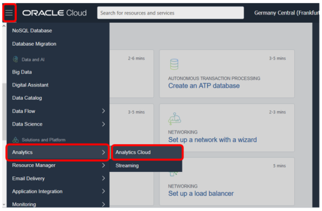
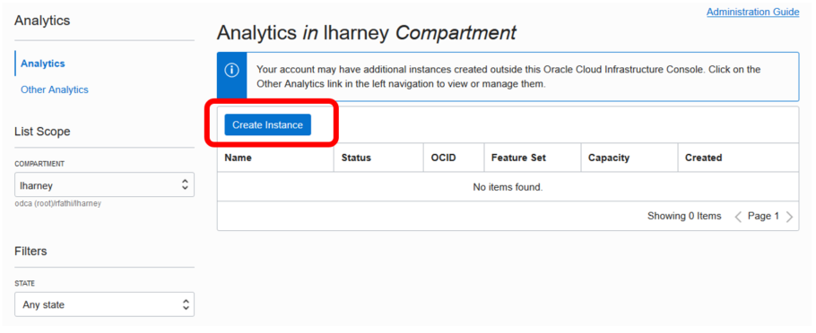
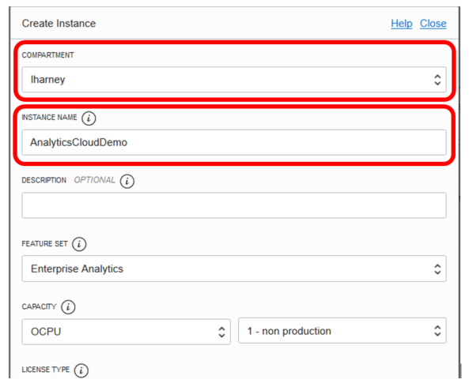
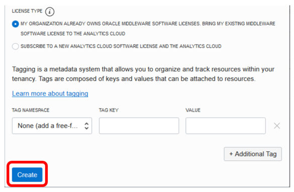
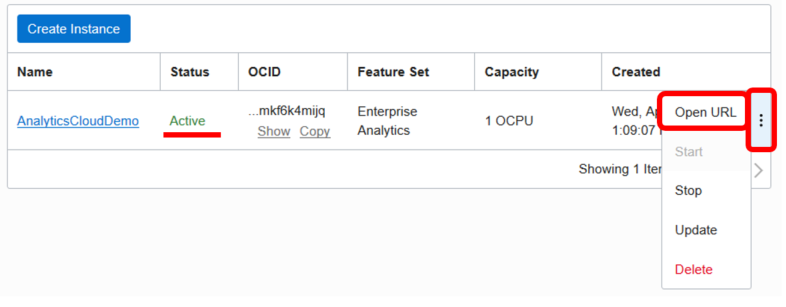
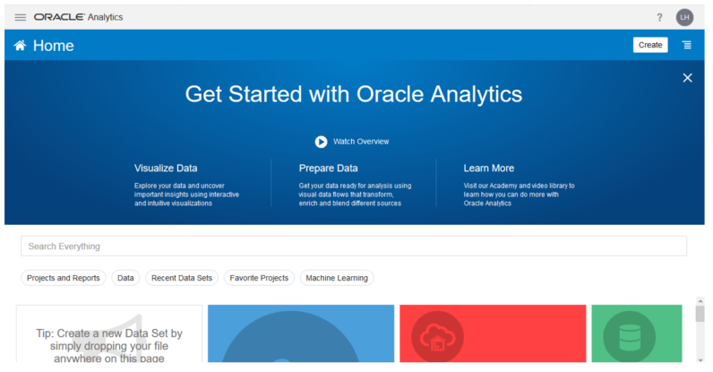

# Lab 0 – Create an Oracle Analytics Cloud (OAC) instance

Click the _**hamburger menu**_ in the upper left corner and click on _**Analytics -> Analytics Cloud**_.

Click _**Create instance**_.

Select a compartment and give the OAC instance a name.

Click _**Create**_ to create the OAC instance.

It takes about _**15-20 minutes**_ to create the OAC instance.

When the status of the instance changes to _Active_, click the _**menu icon**_ and then select _**Open URL**_ to open the OAC instance.

Welcome to Oracle Analytics Cloud.
