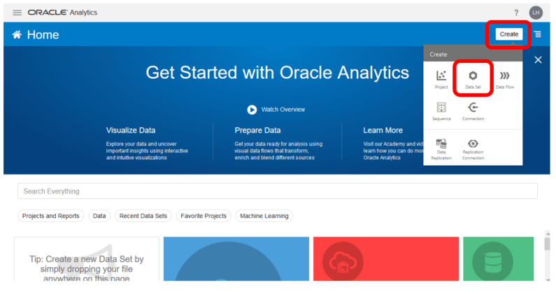
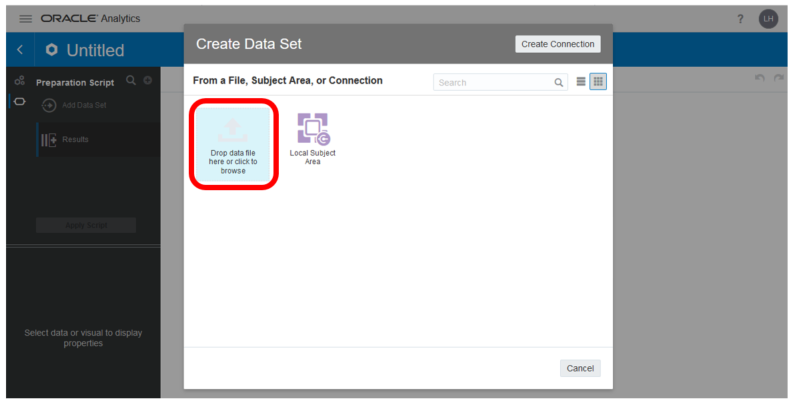
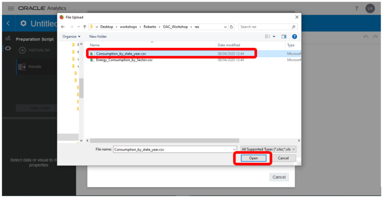
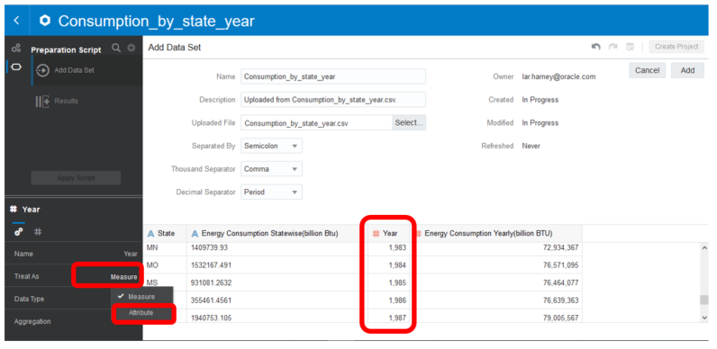
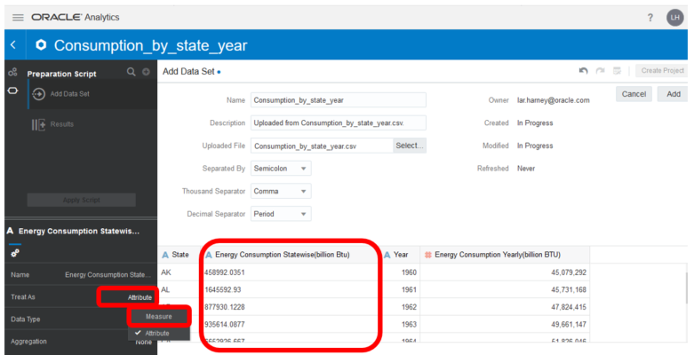
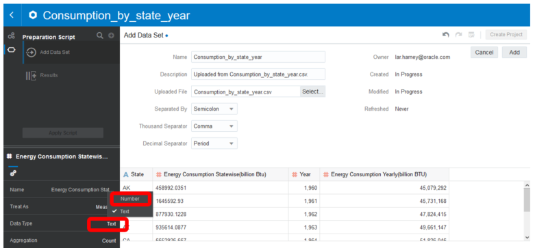
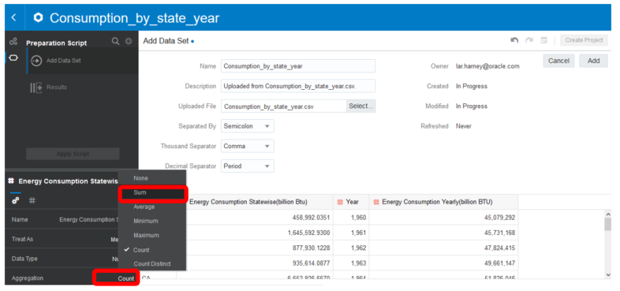
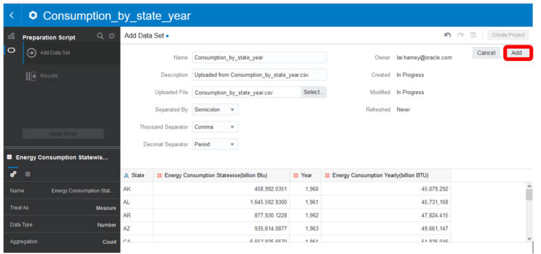
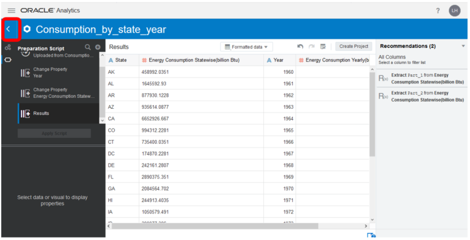

## Lab 1 – Create a Data Sets by adding a Spreadsheets from your Computer
You can create a data set from an Excel spreadsheet (XLSX or XLS), CSV file, or TXT file located on your computer. 

_Note:_ You can't import an Excel spreadsheet that contains pivoted data. 

Download the following CSV files which contain all the required resources for this section at the following
Links:

1. [Consumption_By_State_Year](https://objectstorage.uk-london-1.oraclecloud.com/p/SD4mcFaQHDAp1rncfmDZyy0BtTZ6qU22jzyi2TcOGgo/n/odca/b/OAC_Workshop/o/Consumption_by_state_year.csv)
2. [Energy_Consumption_by_Sector](https://objectstorage.uk-london-1.oraclecloud.com/p/i-edAv1mlbLMlq_bcqZihRfNQSVZd8IEv6eUx_rrIvU/n/odca/b/OAC_Workshop/o/Energy_Consumption_by_Sector.csv)

And now proceed uploading the following CSV files as a new Data Set on OAC.

On the Home page, in the top-right of the screen click _**Create**_, and then click _**Data Set**_.

Click _**Drop data file here or click to browse**_ to select an XLSX or XLS (with unpivoted data), CSV, or TXT file. 

Select _**Consumption_By_State_Year.csv**_ and then click _**Open**_ to upload and open the selected spreadsheet.

Make any required name, description, or column attribute changes.

The _**Year**_ column must be changed from being a measure to an attribute:
1. Select the _**Year**_ column.
2. Click the _**Treat As**_ button.
3. Select _**Attribute**_.

The _**Energy Consumption Statewise(billion BTU)**_ column must be changed from being an attribute to a meaure.
1. Select the _**Energy Consumption Statewise(billion BTU)**_ column.
2. Click the _**Treat As**_ button.
3. Select _**Measure**_.

4. While  _**Energy Consumption Statewise(billion BTU)**_ column is still selected, select _**Data Type**_.
5. Select _**Number**_.

6. While  _**Energy Consumption Statewise(billion BTU)**_ column is still selected, select _**Aggregation**_.
7. Select _**Sum**_.

Click _**Add**_ to create the data set.

Click _**<**_ icon in the  top-left corner to return to the home screen.

Repeat this process to create the _**Energy_Consumption_by_Sector**_ data set. 

Make sure to change the _**Year**_ column from being a measure to an attribute.