# Lab 2 - Create a simple data visualization project with Oracle Analytics Cloud with multiple Canvases

## Introduction
In this part of the lab, we will create basic interactive canvases within a single project. You will see how easy and powerful you can gain insights and visualize your data in just a few clicks. 

This lab is not intended to be an exhaustive view of all Oracle Analytics Cloud capabilities, but it wants to show how a Self Service Data Analysis can be made and therefore submit your data into three phases: prepare, visualize and narrate.

You will create a basic interactive dashboard with 3 canvases that summarize:
- Overview Dashboard.
- Energy Consumption by Location.
- Energy Consumption by type of housing.

On the left corner select the _**Create**_ button and then select _**Project**_.

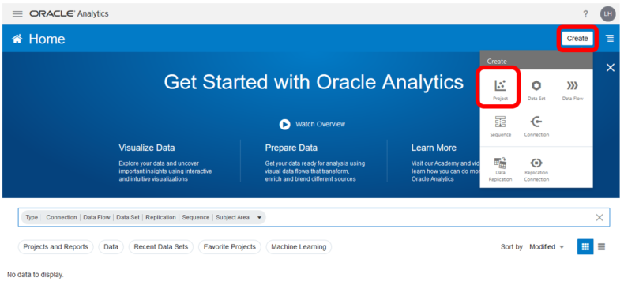

Select on the pop-up windows all the Data Set created previously and then click the _**Add to Project**_ button.

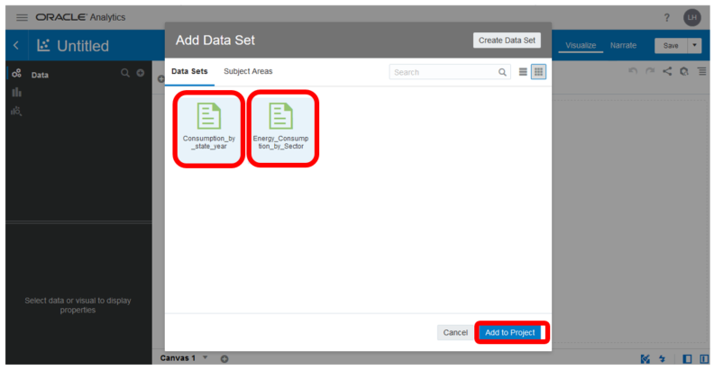

Once you created the new project, this is your new blank canvas.

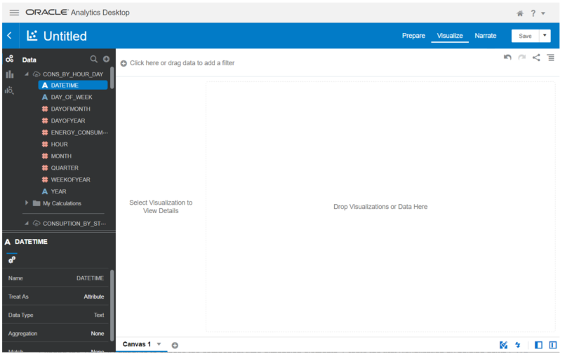

## Canvas 1
Questions answered in this section:
1. How has annual Energy Consumption evolved in the USA during the last 60 years?
2. Which sectors are the top three in consumption?
3. How is Consumption Energy spread statewide?

We will create the following canvas using different charts to answer these questions.

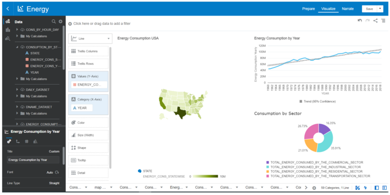

_Graph 1 – Annual Energy Consumption by year_

On this blank canvas, it is possible to create visualizations by simply drag and drop. 

Under the table _**Consumption_By_State_Year**_ we can create our first visualization by _**holding down CTRL**_ and multi-selecting _**YEAR**_ and _**ENERGY_CONS_YEARLY**_ attributes. 

Drag those 2 fields from the left navigation panel to the center blank canvas. A suggested plot is created automatically. From the chart icon at the top left change the chart type to a _**combo chart**_. 

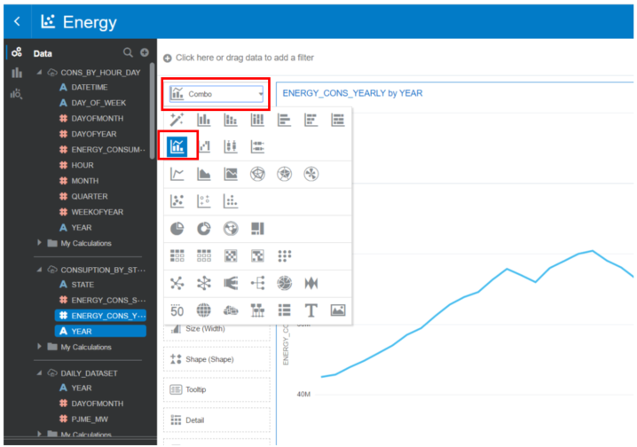

Furthermore, it is possible to add analytics tools as a trend, reference and forecast line for example. 
In our canvas, we will use a trend line. 

Click the _**analytics**_ button and then directly drag the _**trend line**_ over the interested chart it will automatically generate the linear trend line.

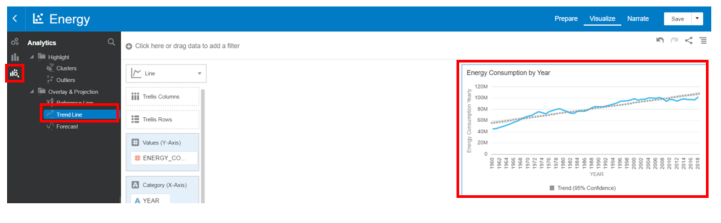

_Graph 2 – Total Energy consumption by Sector_

Select the _**data icon**_ to return to the data view.

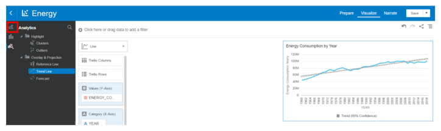

Under the table _**Energy_Consumption_by_Sector**_, holding down CTRL and multi-select the following attributes:
- TOTAL_ENERGY_CONSUMED_BY_THE_COMMERCIAL_SECTOR
- TOTAL_ENERGY_CONSUMED_BY_THE_INDUSTRIAL_SECTOR
- TOTAL_ENERGY_CONSUMED_BY_THE_RESIDENTIAL_SECTOR
- TOTAL_ENERGY_CONSUMED_BY_THE_TRANPORTATION_SECTOR

and right-click on those 4 fields and click _**Pick Visualisation**_. Select as a chart type a _**donut**_ chart. The result should be a canvas which contains both the graphs in the same window.

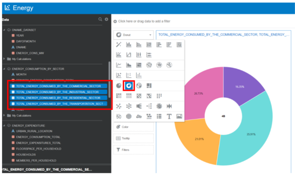

- _Graph 3 – Energy Consumption in the USA_

Make sure all fields are in the _# Values (Slice)_ section.

If any of the fields are in the _Color_ section, click and drag the field to the _# Values (Slice)_.

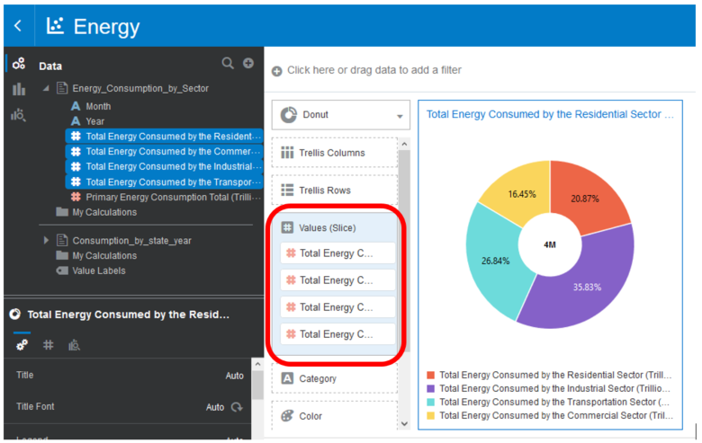

Under the table _**Consumption_By_State_Year**_, holding down CTRL and multi-selecting _**STATE**_ and _**ENERGY_CONS_STATEWISE**_. Right-Click on these 2 fields and select _**Pick Visualization**_. From the chart icon at the top left change the chart type to a _**map chart**_. Here is showed the yearly total consumption for each state in the USA.

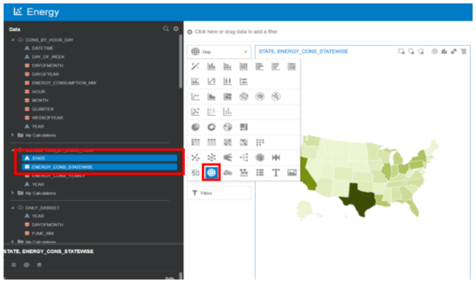

Every chart in the canvas can be moved and dimensioned in the canvas tab as we prefer, to model a custom dashboard. Through this dashboard, we can easily answer questions such as those at the beginning of this paragraph. As showed in _graph 1_ the yearly consumption of energy has constantly increased until the year 2000 and then it holds values in a range between 95M and 102M.

Click the _**Save**_ button.
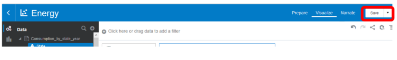

Give the project a name and click the _**Save**_ button.
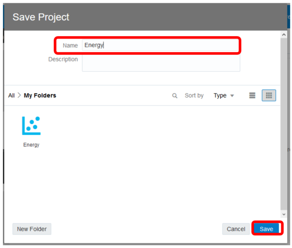
