# Lab 3 – Machine Learning

You can use machine learning to make predictions using your existing data.

In this lab, we are going to predict the production of energy from wind through a linear model algorithm. 

Download the following files which are all the required resources for training and testing the model:

1. [Energy_Train (data for training the model)](https://objectstorage.uk-london-1.oraclecloud.com/p/fhA_IwnL_RKfyzZZyXVgh5NjnEVO0xXlGOG-crZiPLI/n/odca/b/OAC_Workshop/o/Energy_Train.xlsx)
2. [ENERGY_TEST (data for testing the model)](https://objectstorage.uk-london-1.oraclecloud.com/p/VAtIaDP5uM7j090s5qxcb2EGxbZSJBcAYFs7JBTa8DY/n/odca/b/OAC_Workshop/o/energy_test.xlsx)

## Step 1: Create data sets

Upload both the data sets that you have downloaded at the beginning of this lab. Replicate the same steps explained in Lab 1 - _Create a Data Set by adding a Spreadsheet from your Computer._

Just as a reminder, on the Home page, in the top-right of the screen click _**Create**_, and then click _**Data Set**_.

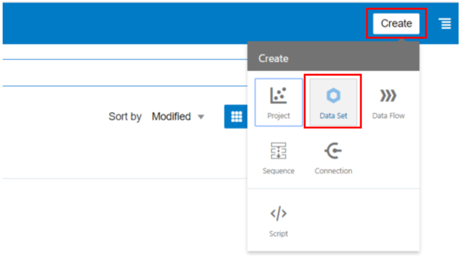

Click _**Drop data file here or click to browse**_ to select an XLSX or XLS (with unpivoted data), CSV, or TXT file. And then click Open to upload and open the selected spreadsheet.

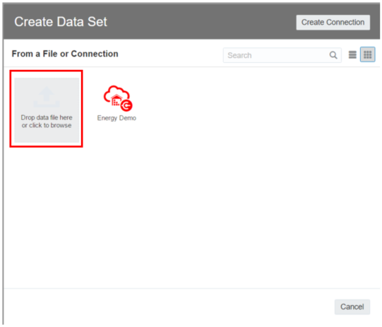

## Step 2: Create and Train a Model using a Data Flow

Once uploaded the data, always from the home page click _**Create**_ and then select _**Data Flow**_ and choose the _**Energy_Train**_ data set for training the model the and then click _**Add**_.

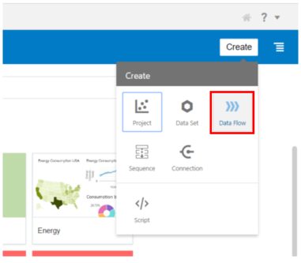

By clicking on the + next to the data set name, it will display all available data flow step options, including train model types (for example, Train Numeric Predictions, Train Multi-Classifier and so on). 

For this lab, we will select the _**Train Numeric Prediction.**_

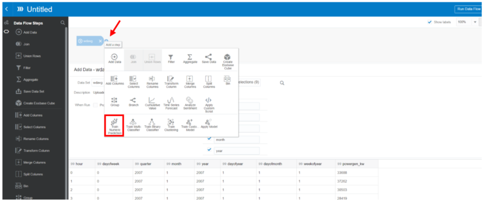

Select for this workshop the _**Linear Regression for model training**_ as an algorithm.

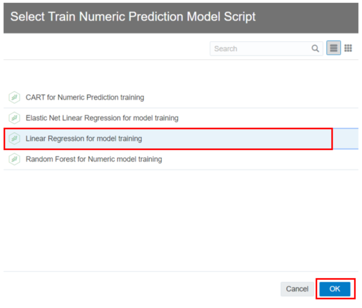

Click on the Target field to select a Data Set column that you want to apply to train the model.
We want to predict the power generated from the wind so select the _**powergen_kw**_ column and let all the other fields as default.

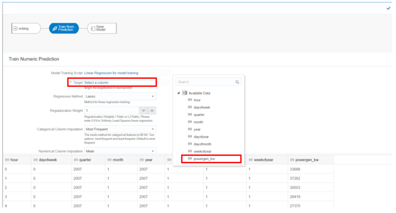

Click the _**Save Model**_ step in the workflow, then provide a name and click _**Run Data Flow.**_

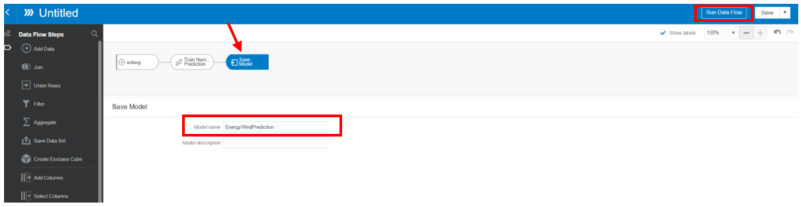

Provide a name for the Data Flow and click on _**Save & Run**_. At this point, we are creating and training the model. This process takes about 5 minutes to complete.

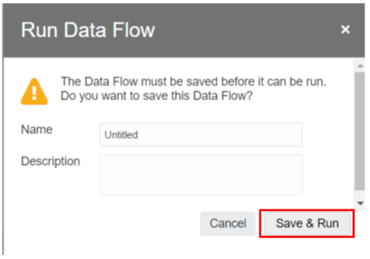

## Step 3: Verify Parameters and Model Quality

Only after, the model completes its training process, we can move to check the parameters and the model quality. From the main page click on the hamburger menu on the top left to access the main menu and then select _**Machine Learning**._

Click on the options button positioned in line with the model just created and select _**Inspect**_.

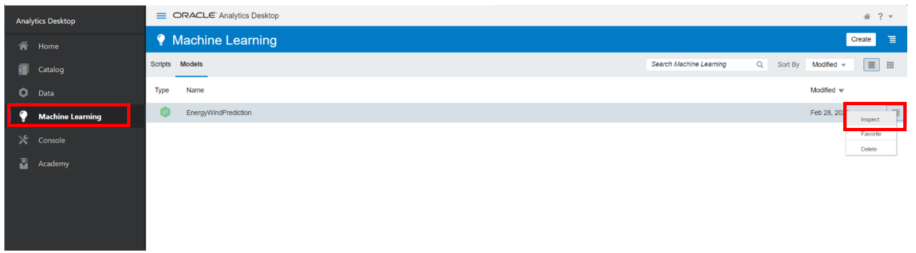

A new window will pop-up and showing all the characteristics of your model. Under the _**Quality**_ tab, the important statistical parameters like Coefficient of Determination (R2) and so on are displayed.

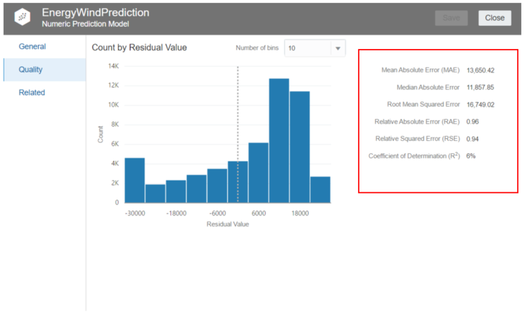

## Step 4: Used the trained Model for Prediction

For predicting future values click on _**Create**_ and select _**Data Flow**_.
Choose the _**energy_test**_ data set and click _**Add**_.

Then click on the **+** button positioned next to the Data Set and select the _**Apply Model**_ as shown in the picture.

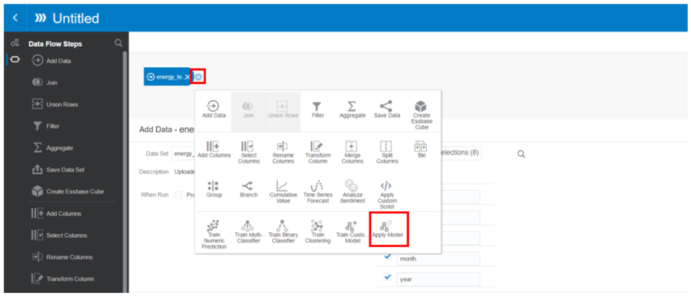

Select the model just created and click _**ok**_, and then always by clicking the + button select _**Save Data**_ for generating a new data set with one column more which contains the predicted values.

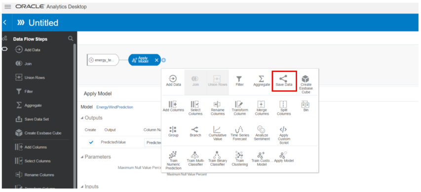

Name the new data set and then click on _**Run Data Flow**_. Before naming, the data flow as your preference and then always click _**Save & Run**_.

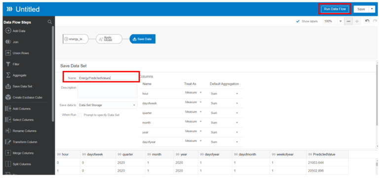

## Step 4: Create a new Dashboard using Predicted Values

Now we want to create another Dashboard utilizing the data just predicted by the algorithm.

From the main menu open the project created in the previous steps, and add a new data set by following the instruction. Under the _**Visualize**_ tab, we can simply add another data set by clicking on the **+** positioned on the top left of the screen and select _**Add Data Set**_.

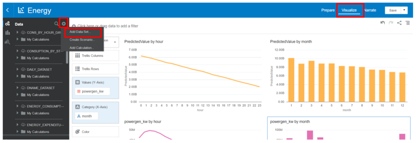

And now select from the pop-up window the _**Data Set which contains the prediction values calculated**_. Repeat this same step and for adding the data used for training the model, namely the _**Energy_Train**_ dataset.

Before proceeding with the new Dashboard, a few steps to adjust the data, in these two new data sets, are required. Under the tab _**Prepare**_,  select the _**predicted value**_ table.

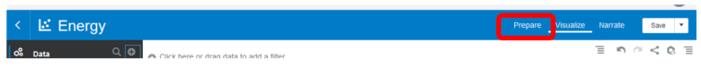

If necessary, change the definition type of data from measures to attribute.
Therefore, after having checked change the columns _**hour**_ and _**month**_ in this way.

Then click _**Apply Script**_ to save changes.

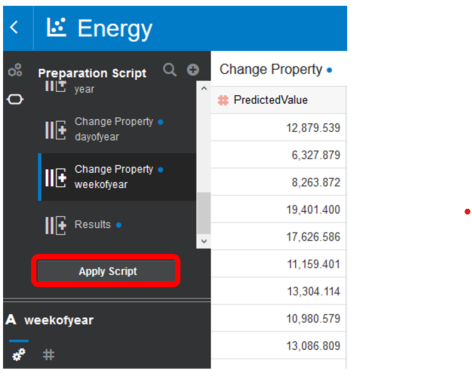

The same process has to been done for the _**Energy_Train**_ dataset, always for the columns _**hour**_ and _**month**_.

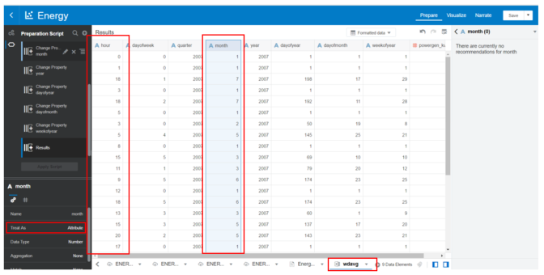

Then click _**Apply Script**_ to save changes.

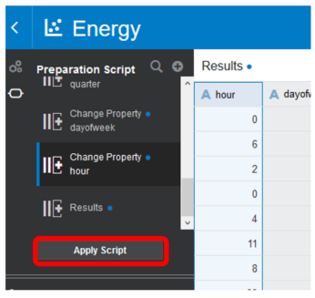

Under the _**Visualize**_ tab, Open a new blank canvas by clicking on the + symbol in the bottom.

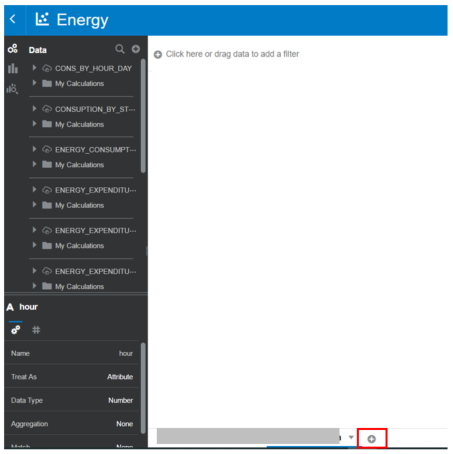

_Graph 1 – Predicted Values during the daily hour_

Under the _**table which contains our predicted values**_ we can create a new graph by holding down CTRL and multi-selecting _**PredictedValue**_ and _**hour**_ attributes. Drag those 2 fields from the left navigation panel to the center blank canvas. From the chart icon at the top left change the chart type to a _**line chart**_. 

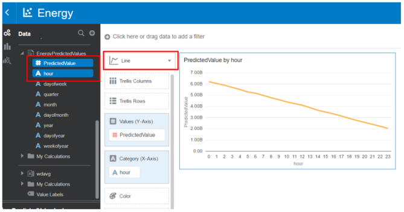

_Graph 2 – Predicted Values during each month_

Always under the _**table which contains our predicted values**_, we can create another graph by holding down CTRL and multi-selecting _**PredictedValue**_ and _**month**_ attributes. Right-click and select _**Pick Visualization**_. From the chart icon at the top left change the chart type to a _**bar chart**_. 

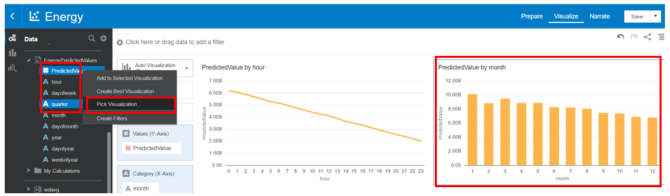

_Graph 3 – Produced energy for wind hourly from training data_

Under the table _**Energy_Train**_, create a new graph by holding down CTRL and multi-selecting _**Powergen_kw**_ and _**hour**_ attributes. Right-click and select _**Pick Visualization**_. From the chart icon at the top left change the chart type to a _**line chart**_. 

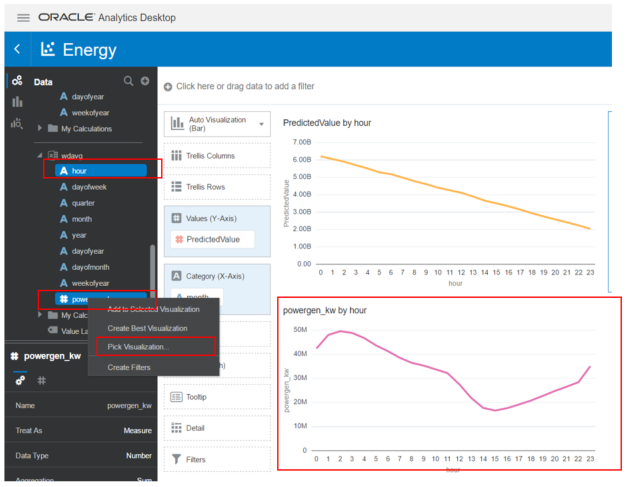

_Graph 4 – Produced energy for wind monthly from training data_

Under the table _**Energy_Train**_, create a new graph by holding down CTRL and multi-selecting _**Powergen_kw**_ and _**month**_ attributes. Right-click and select _**Pick Visualization**_. From the chart icon at the top left change the chart type to a _**bar chart**_. 

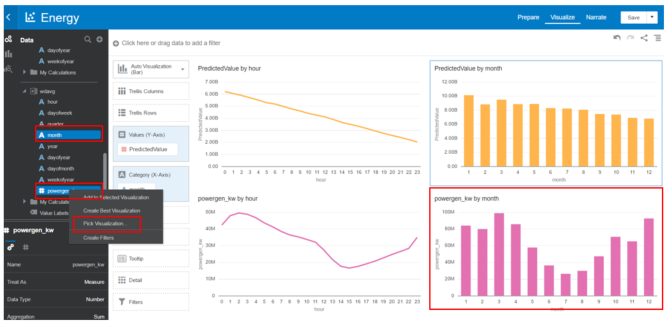
