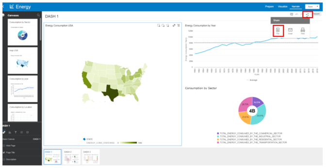
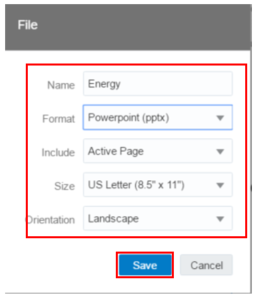

# Lab 4 - How to export a Dashboard 

You can export one or more of your project's visualizations, canvases, or stories as a Portable Document Format (PDF), PowerPoint (PPT) file or e-mail.

Under the _**Narrate tab**_, Select the visualization you want to export and click Menu or right-click and click _**Share**_, then select As PDF or As PPT. Alternatively, click _**Share Project**_ on the project toolbar and _**select File**_. 

Choose the desired export format and all the other options.

Click _**Save**_ to open the Save File dialog.

In Save File dialog, change the file name, making sure to include the file extension, and browse to the location where you want to save the file.